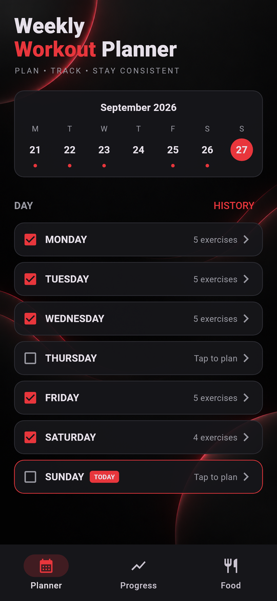
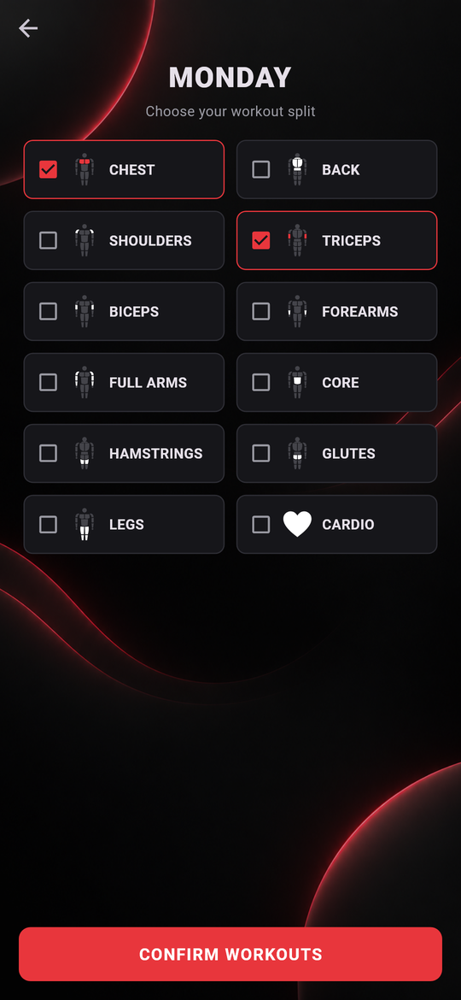
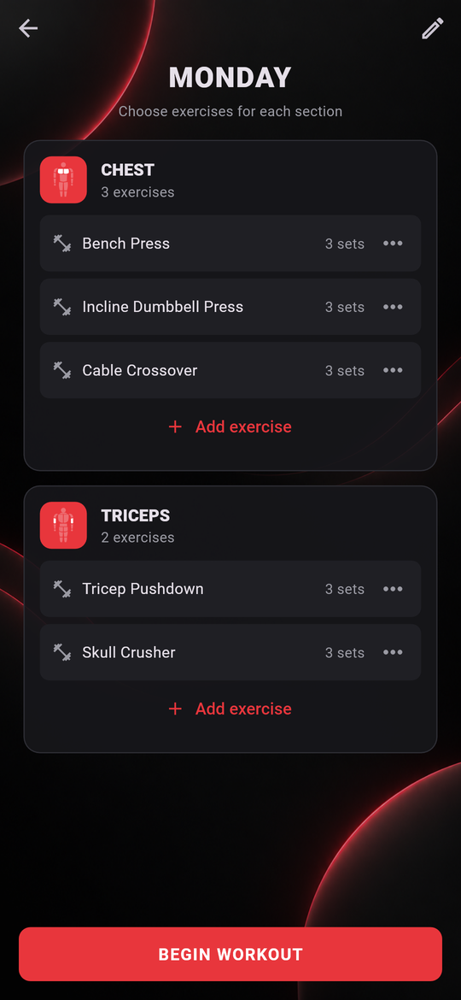
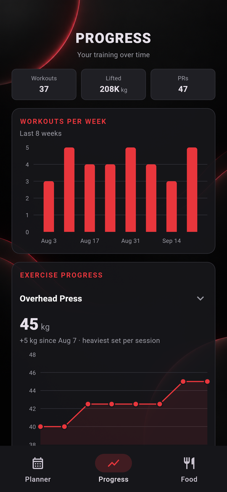
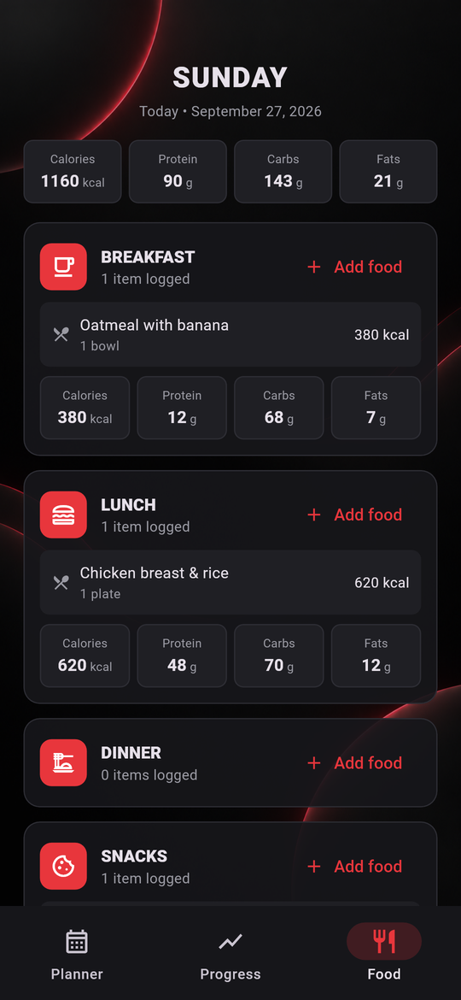

# Workout Tracker

A Flutter mobile app for planning a weekly training split, logging workouts set by set, tracking progress over time, and keeping a food log.

**[⬇ Download the Android APK](https://github.com/rendell-11/workout-tracker/releases/latest)** · When the app opens, tap **"Just exploring? Try it with demo data"** to explore it with eight weeks of sample workouts already filled in.

<!-- Browser preview: add the Appetize.io link here, e.g.
**[▶ Try it in your browser](https://appetize.io/app/...)**
-->

<p align="center">
  
  
  
  
  
</p>

## Features

- **Weekly planner.** Pick a split for each day (chest, back, legs, cardio and more). Each muscle group has its own icon showing the muscle it trains.
- **Exercise library.** More than 50 exercises with equipment, form cues and target muscles.
- **Workout logging.** Start a workout, check off sets as you go and track weight and reps. New exercises are prefilled with the numbers from your last session.
- **Workout summary.** See duration, volume, estimated calories and personal records when you finish a workout.
- **Progress charts.** Workouts per week, plus heaviest set per session for any exercise.
- **Food tracker.** Log meals with calories, protein, carbs and fat.
- **Profile and BMI.** Goals, target weight and a live BMI readout.
- **Saved on the device.** Your profile, plans, history and food log are kept between launches.

## Tech stack

- **Flutter / Dart**, Material 3 with a custom dark theme
- **State:** a single `ChangeNotifier` provided through an `InheritedNotifier`
- **Storage:** `shared_preferences`, with JSON serialization for each model
- **Charts:** `fl_chart`
- **Graphics:** custom-painted muscle icons (`CustomPainter`) and SVG assets (`flutter_svg`)

## Project structure

```
lib/
  main.dart           App entry; loads saved state before the first frame
  models.dart         Data models, exercise library, app state and persistence
  demo_data.dart      Sample profile, split and 8 weeks of history
  theme.dart          Colors and theme
  screens/            One file per screen (planner, workout, progress, food, ...)
  widgets/            Shared widgets, including the muscle-group icons
test/                 Widget and persistence tests
```

## Running it

Requires the [Flutter SDK](https://docs.flutter.dev/get-started/install).

```bash
flutter pub get
flutter run            # on a connected device or emulator
flutter test           # run the tests
flutter build apk --split-per-abi   # build installable APKs
```
